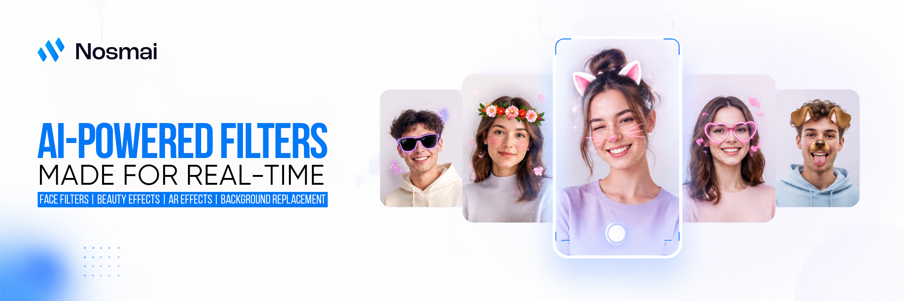

# Nosmai Effects SDK for Flutter

Add real-time AR effects, beauty filters, digital makeup, background replacement,
interactive camera games, camera capture, and cloud filters to Flutter
applications through one SDK for Android and iOS.

## Built for

Nosmai Effects can be used in:

- social media and short-video apps
- live streaming and video chat
- creator cameras and recording tools
- beauty and makeup experiences
- photo and video editing workflows
- virtual background experiences
- entertainment and interactive camera apps

## Key features

- Real-time camera preview with GPU-accelerated rendering
- Face detection and face-tracked AR effects
- 3D masks, stickers, particles, and animated overlays
- Skin smoothing, whitening, sharpening, and teeth whitening
- Lipstick, eyeshadow, blusher, eyelashes, and eyebrows
- Face slimming, eye size, nose, chin, jaw, lips, forehead, and brow controls
- LUT filters, brightness, contrast, hue, saturation, RGB, and white balance
- Background blur, color, image, video, and packaged background effects
- Interactive `.nosmai` games with touch/face input and typed event streams
- Local and cloud-based `.nosmai` filters
- Cloud filter browsing, pagination, download, caching, and removal
- Front and back camera switching
- Photo capture and processed video recording
- Processed camera output for live streaming integrations

## On-device processing

Camera frames, face tracking, beauty, AR effects, and background processing run
on the user's device. Camera frames do not need to be uploaded to apply visual
effects.

Network access is used for license verification, cloud filter discovery, and
filter downloads.

## Platform support

| Platform | Minimum requirement |
| --- | --- |
| Android | API 21 or later, physical `arm64-v8a` device |
| iOS | iOS 15.0 or later, physical arm64 device |
| Flutter | Flutter 3.22.0 or later, Dart 3.0.0 or later |

Camera preview, face tracking, recording, and performance should be tested on
physical devices. The iOS simulator is not supported by the native Effects SDK.

## Getting started

Add `nosmai_effects_sdk` to your Flutter application and follow the official
Flutter integration guide for licensing, native setup, permissions, camera
lifecycle, filters, capture, and production requirements.

- [Introduction](https://nosmai.com/docs/effects/introduction/)
- [Flutter platform guide](https://nosmai.com/docs/effects/platforms/flutter/)
- [Flutter installation](https://nosmai.com/docs/effects/installation/flutter/)
- [License key](https://nosmai.com/docs/effects/license-key/)
- [Apply a beauty filter](https://nosmai.com/docs/effects/guides/effects/apply-a-beauty-filter/flutter/)
- [Filters and effects](https://nosmai.com/docs/effects/concepts/filters-and-effects/)
- [Cloud filters](https://nosmai.com/docs/effects/concepts/cloud-filters/)
- [Flutter live streaming with Agora](https://nosmai.com/docs/effects/integrations/agora/flutter/)
- [Troubleshooting](https://nosmai.com/docs/effects/troubleshooting/)

A valid Nosmai license key is required. Create and manage projects through the
[Nosmai Console](https://console.nosmai.com/).

## Native SDK distribution

- Version `1.0.1` uses Android Effects SDK `3.0.3` and resolves
  `NosmaiCameraSDK 3.0.3` through CocoaPods on iOS.
- Android applications download the proprietary AAR and `SHA256SUMS` from
  [Nosmai Effects SDK for Android releases](https://github.com/nosmai/nosmai_effects_sdk_android/releases/latest).
- Native SDK binaries and licensed `.nosmai` assets are not bundled in the
  pub.dev package.

See the Flutter integration guide for the current compatible native SDK
versions and installation steps.

## Support

- [Documentation](https://nosmai.com/docs/effects/introduction/)
- [GitHub issues](https://github.com/nosmai/nosmai_effects_sdk_flutter/issues)
- [Nosmai Effects](https://effects.nosmai.com/)
- Email: admin@nosmai.com

## License

This Flutter plugin and its associated native SDKs are proprietary commercial
software. A valid agreement and license key are required. See [LICENSE](LICENSE)
for the applicable terms.
